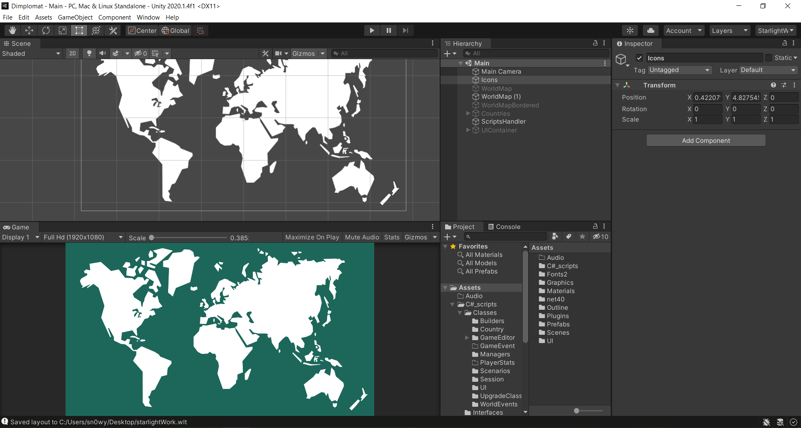

# Unity-Layout-Collection
Collection of good unity layouts. 

## What is this repository for?

This is collection of good and practical layouts, for every aspect of developing in unity, like animating, debugging, profiling, etc. 

## How to contribute my Layout? 

First, save your layout as a .wlt file and take a screenshot of the layout.
All the images must be in the img directory of the repo. All .wlt files must be layout directory. Your image file and .wlt file must have the same name.
In the pull request, you can describe the layout and put the image in the README. You can probably tag the author / nickname of the github user.
Then you can make a pull request with your image, layout file and edited README.
You can see examples below

### StarlightWork by @Sn0wy-0wl

This is my main working layout. It is kind of upgraded 2 by 3 unity default layout, and used most of my developing time. 
